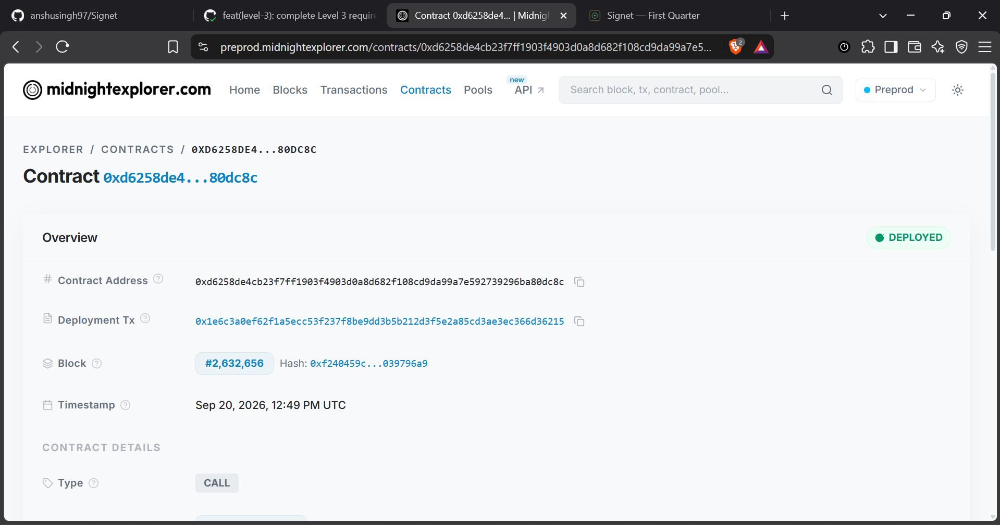
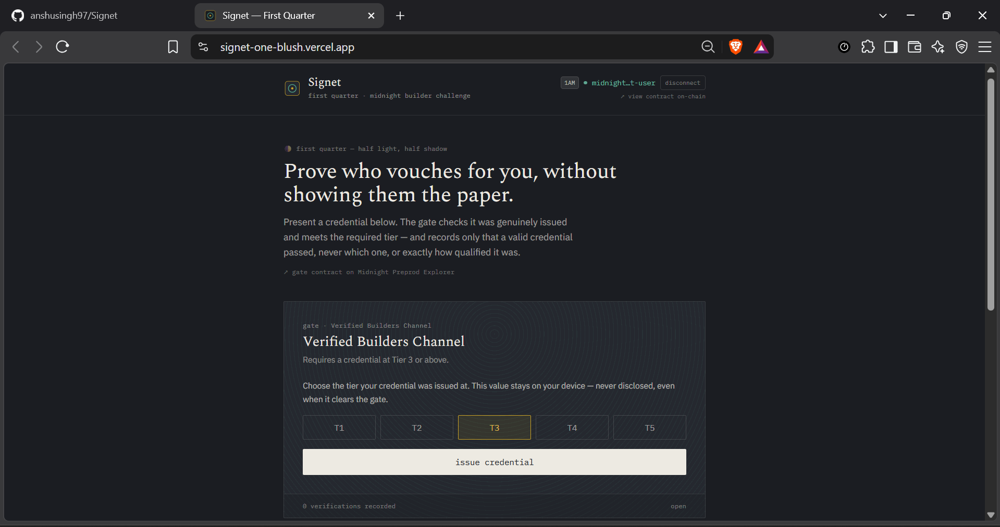
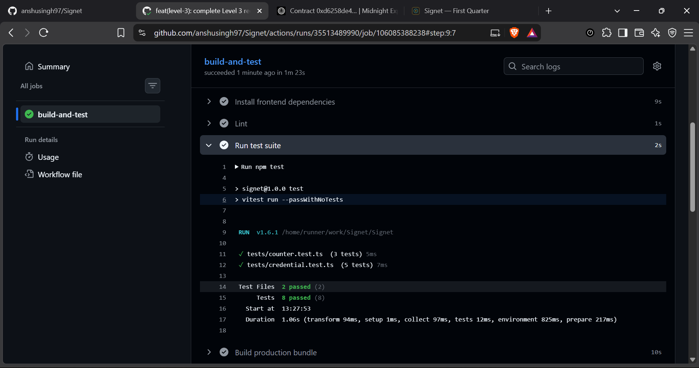
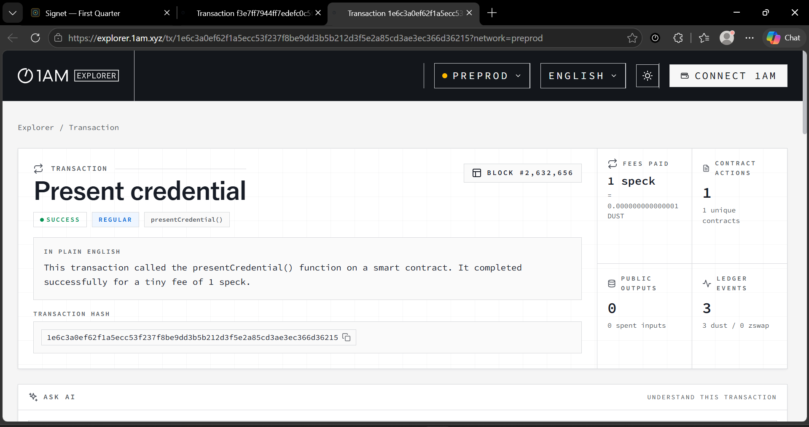

# CredProve
[](https://github.com/lilawti-lila620/CREDENPROVE/actions/workflows/ci.yml)
> Prove a credential is valid — and meets a threshold — without disclosing it. Built on Midnight.

## Live Demo
https://credenprove.vercel.app

## Demo Video
🎥 [Watch the 1-Minute Walkthrough Video (Google Drive)](https://drive.google.com/file/d/1Q-uuKpG_QyRkoZlabIHLKox3Qf7UoJ2I/view?usp=sharing)

## Contract Address
| Network  | Address                          |
|----------|----------------------------------|
| Preprod  | `d6f9af1c8241e874ecef7482db25153e23415d55c7c3f3b5b5d389d9308b79a2` |

- 🔍 **Contract on Midnight Explorer:** [View Preprod Contract](https://preprod.midnight.network/contract/d6f9af1c8241e874ecef7482db25153e23415d55c7c3f3b5b5d389d9308b79a2)
- ⚡ **Confirmed On-Chain Transaction:** [View Extrinsic on 1AM Explorer](https://explorer.1am.xyz/tx/1e6c3a0ef62f1a5ecc53f237f8be9dd3b5b212d3f5e2a85cd3ae3ec366d36215?network=preprod)



## What This Does
CredProve lets an organization or issuer open a "gate" in front of a restricted resource—such as a developer channel, a grant distribution pool, an exclusive voting round, or an accredited community.

The gate requires a credential at or above a specified tier. Using zero-knowledge proofs on Midnight, credential holders prove that they possess a genuine credential meeting the qualification tier without ever disclosing:
- The credential secret or private seed
- Their exact tier score above the required threshold
- Their real-world identity or wallet linkability

The application generates a client-side zero-knowledge proof, pays network fees using Midnight DUST, balances the transaction with 1AM Wallet, and submits the proof on-chain to the Preprod network, leaving only a cryptographic nullifier and an incremented verification counter.



## Privacy Model
- PUBLIC:
  - The gated resource name (e.g., "Verified Builders Channel")
  - The minimum required tier threshold (e.g., Tier 3)
  - The total verified presentation count recorded on the contract
  - The set of spent nullifier hashes (used to strictly prevent double-presentation)
- PRIVATE:
  - The credential secret key and witness data
  - The holder's exact tier score (concealed whether it is Tier 3, 4, or 5)
  - The link between the holder's wallet/identity and the spent nullifier
- PROVED without revealing:
  - Proved that the caller holds a valid credential whose tier is greater than or equal to the gate's required threshold, and that this credential has not been previously spent at this gate—without revealing the credential secret or the exact tier value.

## Privacy Claim
An on-chain observer or verifier can see the total number of credentials that have cleared the gate at any time, and can verify that no credential has been submitted twice (since the nullifier set only grows monotonically). What an observer cannot see or infer at any point:
1. Whose credential was used (no wallet or identity link exists in the proof or ledger state).
2. The exact tier or score of the holder (the proof only establishes the inequality `tier >= requiredTier`).
3. Which nullifier belongs to which holder or off-chain credential.

## Tech Stack
- **ZK Smart Contract:** Compact (`contracts/credential.compact`) compiled with Midnight Compact compiler
- **Network:** Midnight Preprod
- **Frontend:** React 18, TypeScript, Vite, Tailwind CSS
- **Wallet Connection:** 1AM Wallet (with DUST registration and native transaction balancing)
- **Testing:** Vitest (comprehensive unit, state transition, circuit logic, and privacy test suites)
- **CI/CD:** GitHub Actions (`.github/workflows/ci.yml`)

## Prerequisites
- Node.js v22+
- npm v10+
- [1AM Wallet](https://1am.xyz) browser extension (configured for Midnight Preprod network, with registered DUST)

## Setup & Run Locally
```bash
# 1. Clone the repository
git clone https://github.com/lilawti-lila620/CREDENPROVE.git
cd CREDENPROVE

# 2. Install dependencies
npm install

# 3. Run the development server
npm run dev

# 4. Build for production
npm run build
```

## Run Tests
```
npm test
```



## CI/CD
The repository uses GitHub Actions (`.github/workflows/ci.yml`) configured to automatically trigger on every `push` and `pull_request` to the `main` branch.

The pipeline performs the following steps:
1. Checks out the code repository.
2. Installs Node.js v22 with npm cache.
3. Installs and configures the Midnight Compact compiler toolchain.
4. Compiles the Compact contract and builds generated TypeScript contract bindings.
5. Installs frontend dependencies.
6. Runs code linting (`npm run lint`).
7. Executes the automated test suite (`npm test` — covering circuit logic, state transitions, and privacy verification).
8. Builds the production bundle (`npm run build`).

A status badge is located at the top of this README showing live workflow status.

## Screenshots & Verification

| Screenshot | Description |
| :--- | :--- |
| **Product UI**<br> | Interactive dApp interface with live 1AM Wallet integration, credential selection, ZK proof generation, and verification status. |
| **On-Chain Transaction**<br> | Confirmed transaction on Midnight Preprod Explorer with cryptographic proof verification and ledger state update.<br>🔗 [View on 1AM Explorer](https://explorer.1am.xyz/tx/1e6c3a0ef62f1a5ecc53f237f8be9dd3b5b212d3f5e2a85cd3ae3ec366d36215?network=preprod) |
| **Contract Explorer**<br> | Midnight Explorer contract page for `d6f9af1c82...` showing contract state, actions, and verification history.<br>🔗 [View on Midnight Explorer](https://preprod.midnight.network/contract/d6f9af1c8241e874ecef7482db25153e23415d55c7c3f3b5b5d389d9308b79a2) |
| **Test Output (8 Passing)**<br> | Vitest test execution output showing 8 passing tests across `tests/counter.test.ts` and `tests/credential.test.ts`. |

## Product Proposal
See [PROPOSAL.md](./PROPOSAL.md) for the complete product specification, target user personas, Midnight architectural rationale, data model, and roadmap to Mainnet.

